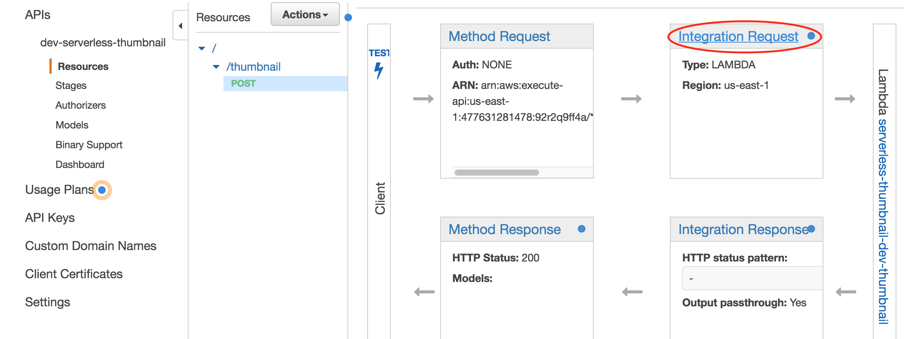
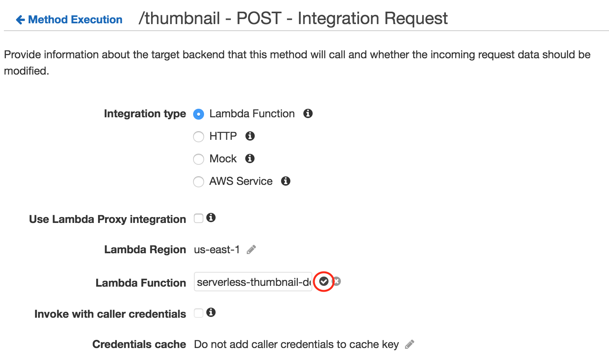
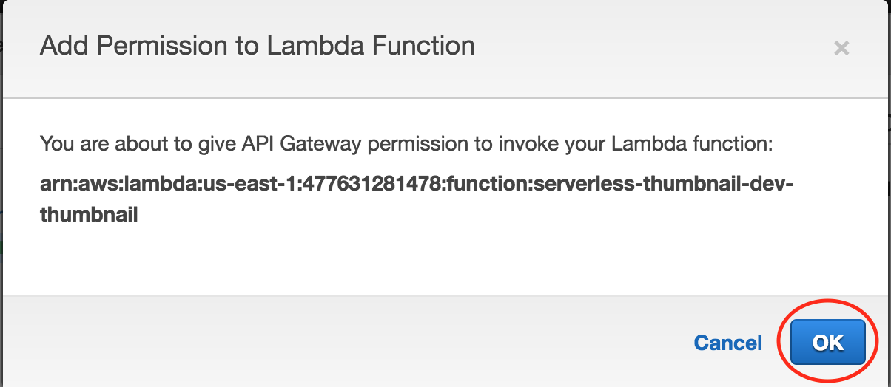

# serverless-thumbnail
Recreate the thumbnail service described here .. https://aws.amazon.com/blogs/compute/binary-support-for-api-integrations-with-amazon-api-gateway/ .. using the serverless.com framework (and document some gotchas).

This README assumes quite a bit of familiarity with Amazon Web Services, particularly Lambda and API Gateway. It also assumes that you use the really excellent [serverless framework](https://serverless.com/) to ease working with Lambda and API Gateway (and, if you're not, I recommend that you do).

The code of the thumbnail Lambda function in index.js is a shameless copy of the code from AWS' image-processing-service Lambda blueprint (the one used in the referenced blog).


Follow these steps to replicate the problem and then make everything work
---
* ```$ sls deploy```
* Login to AWS and go to API Gateway console
* Add image/png as a media type under the Binary Support section of the dev-serverless-thumbnail API.


* Deploy your dev-serverless-thumbnail to the dev stage using the API Gateway console. I'm not strictly sure that this is necessary but have found that most changes at the API Gateway console aren't picked up by my APIs until I deploy them again.
* Grab a png file for which you have ALWAYS wanted a thumbnail (like apigateway.png) and save it locally.
* POST that file to your endpoint ..

```bash
$ curl --request POST -H "Accept: image/png" -H "Content-Type: image/png" --data-binary "@apigateway.png" https://XXXXX.execute-api.us-east-1.amazonaws.com/dev/thumbnail > apigateway-thumb.png
```

* If you open apigateway-thumb.png in a text editor, you'll find you got a pretty generic error message .. ```{"message": "Internal server error"}``` This didn't come from your Lambda function, but was caused by an API Gateway configuration error. You can take my word for it, or enable logging for API Gateway using the excellent instructions here .. https://kennbrodhagen.net/2016/07/23/how-to-enable-logging-for-api-gateway/. After you've enabled logging and POSTed to your endpoint using curl again, you'll see some not-terribly-helpful log entries in your API Gateway logs (located in CloudWatch if you followed the instructions from Ken's blog) ..

```
Method request body before transformations: [Binary Data]
Execution failed due to configuration error: Unable to transform request
Method completed with status: 500
```

Buggers. Here's the fix. I'm not sure how I found this other than hours of banging my head and just trying stuff at the API Gateway console. 

* In API Gateway console, select 'Resources' for your dev-serverless-thumbnail API. Select the 'POST' method execution and then click on 'Integration Request'.



* Click the pencil (Edit) icon beside the name of your Lambda function (serverless-thumbnail-dev-thumbnail).


* Click the check (Update) icon for the Lambda function.



* You'll be prompted to give API Gateway permission to invoke your Lambda function. Click OK to this. !THIS! is the ticket .. THIS must be the magic behind-the-scenes-permission that the AWS Console makes happen that CloudFormation doesn't when the serverless framework deploys your service.



* But .. you're not out of the woods yet. Make sure you deploy your dev-serverless-thumbnail API again to the dev stage using the API Gateway console so that the change is effective for your currently deployed API.
* Now try that post again ..

```bash
$ curl --request POST -H "Accept: image/png" -H "Content-Type: image/png" --data-binary "@apigateway.png" https://92r2q9ff4a.execute-api.us-east-1.amazonaws.com/dev/thumbnail > apigateway-thumb.png
```

* Woot! Thumbnail generated and available at apigateway-thumb.png.

I've found that everytime I run ```sls deploy``` to deploy my service using the serverless framework, I also have to repeat steps 8-12 so that API Gateway has the permission to invoke my Lambda service. This feels like a bug with API Gateway or a CloudFormation limitation.  *Maybe* there is a CloudFormation workaround that the serverless framework can provide. But I can certainly say that 'Execution failed due to configuration error: Unable to transform request' was not that helpful when trying to figure out what was needed to make this work.

